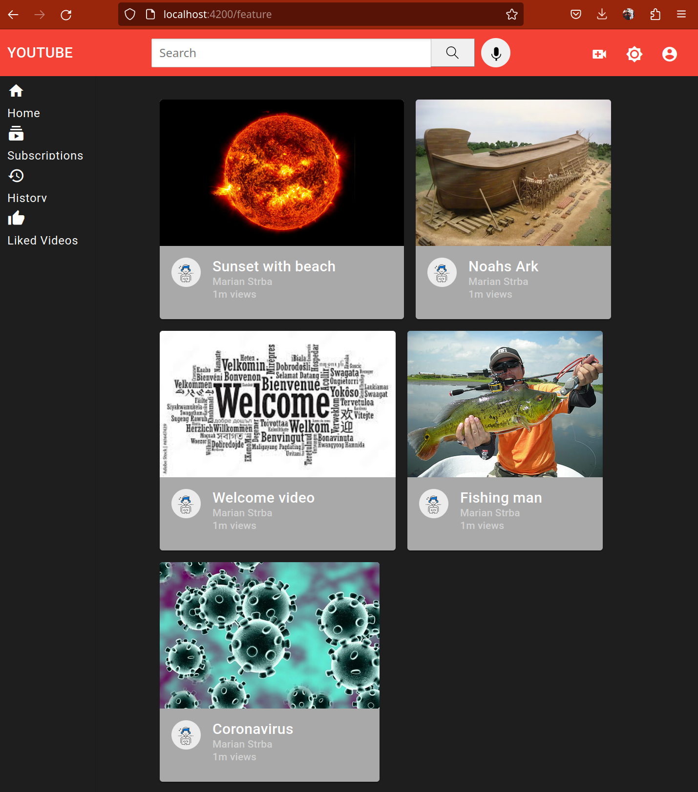
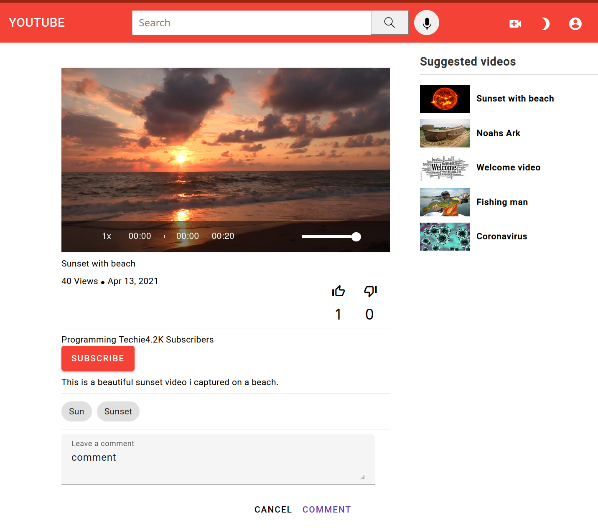
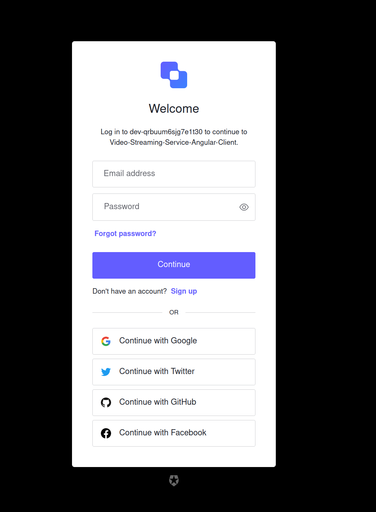
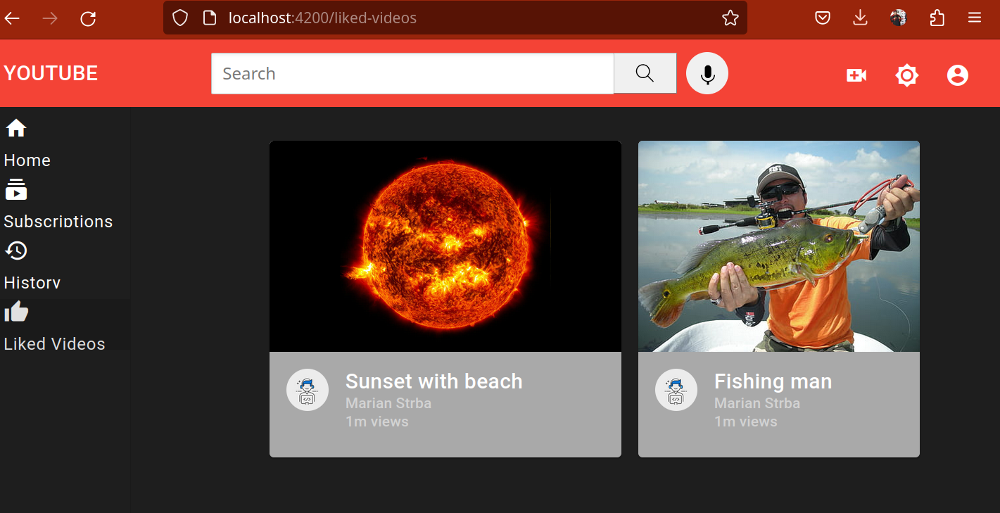
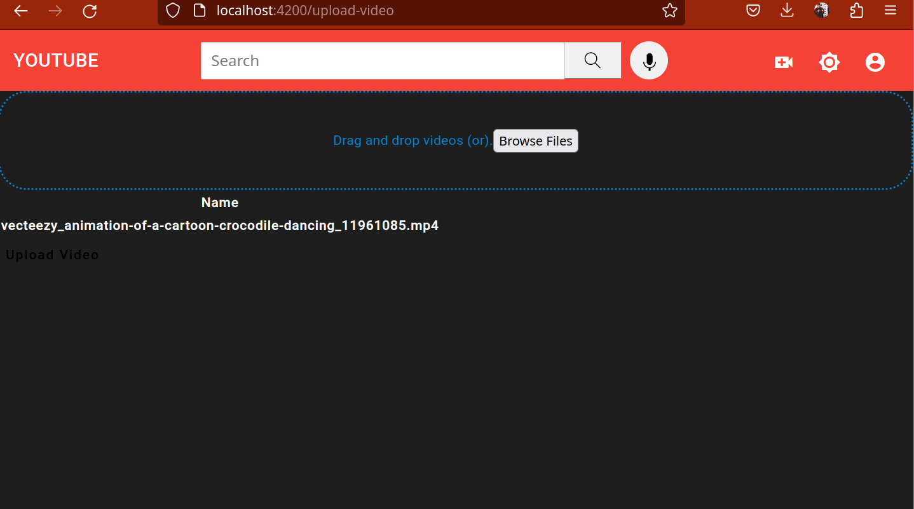
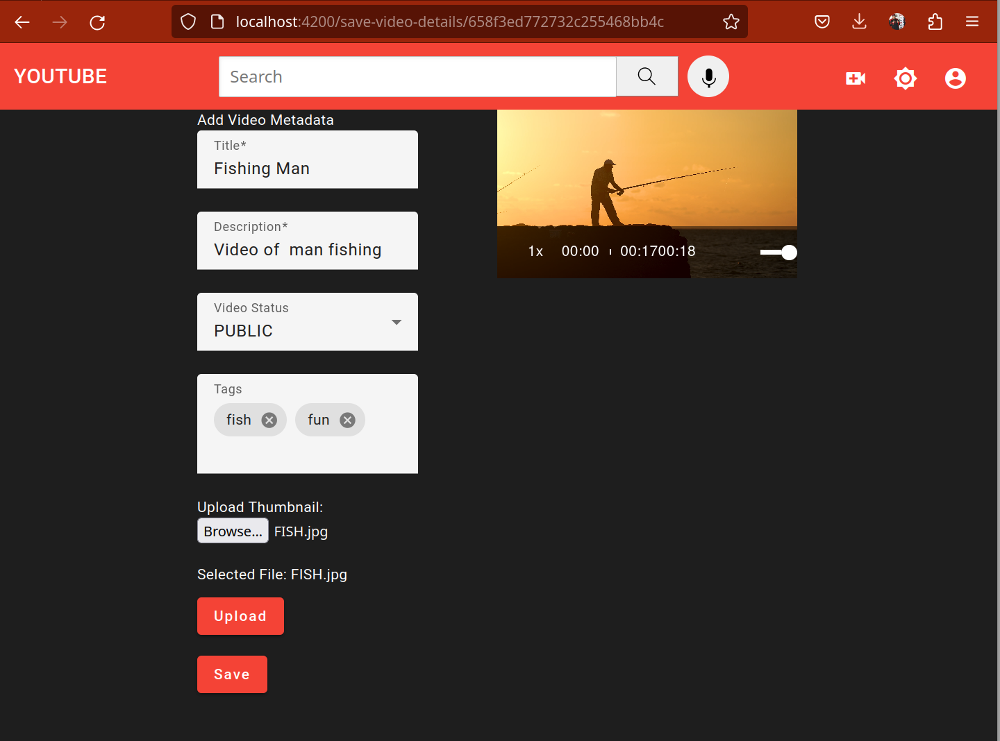
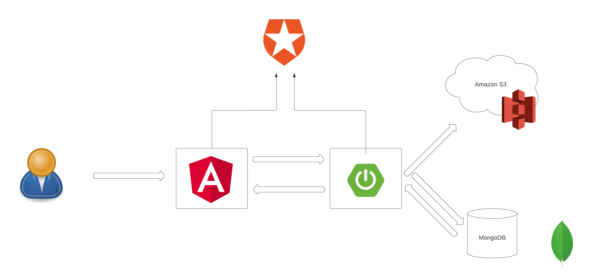
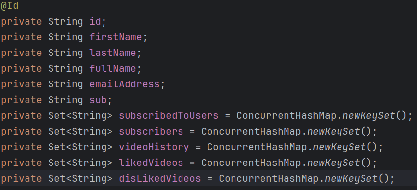
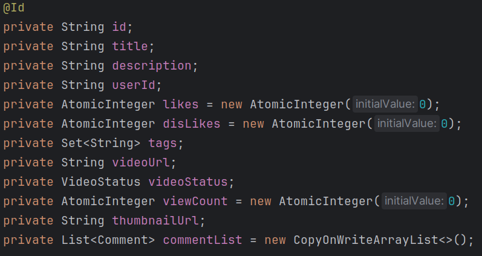
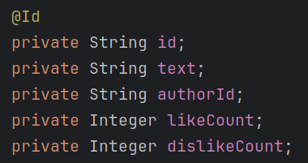

  

<h3 align="center">Video-Streaming-Service</h3>

---

    The goal of this project was to deepen my knowledge of Java and Spring framework,      
    learn frontend framework like Angular and to try to build a fullstack application.
      

## 🧐 About

This application recreates basic functionality of a YouTube application.  
When user starts the application he will see a home screen of videos.    

He can then of course watch this video. With full experience.  
User can subscribe to the author of the video. Like (or dislike) this video and leave a comment.  

Before that he must login into the application.  

After watching a few videos user can look into his video history as well to his liked videos or check users he is subscribed to.  

And if the user also wants to share his own videos he can do so.

## 🏗️ Architecture

This is a high level diagram of my application

User interacts with the frontend part which sends and receives request from Spring REST API.
The Server side communicates with database (it saves metadata there) and saves the actual images and videos to cloud.
Also user authentication is implemented from the frontend and backend.

## 🗃️ Database

User model:  
  
Video model:  

Comment model:  

## ⛏️ Built Using
-   
-   
-    
-   
